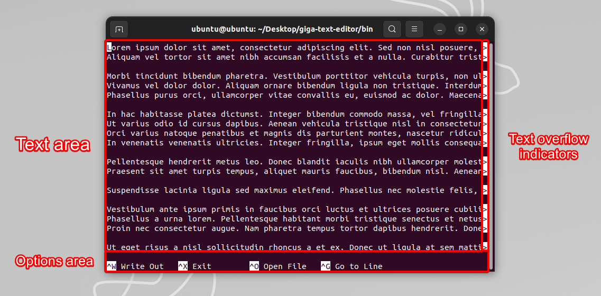
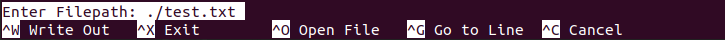
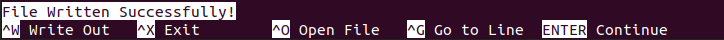
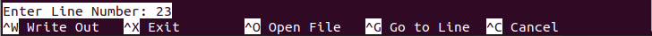

## Build instructions for ubuntu
- `sudo apt update`
- `sudo apt install libncursesw5-dev pkg-config`
- `git clone https://github.com/D-Chandrahas/giga-text-editor`
- `cd giga-text-editor/src`
- `g++ -O3 *.cpp -o ../bin/giga $(pkg-config ncursesw --cflags --libs)`
- `cd ../bin`
- you can find the compiled binary in `giga-text-editor/bin`
- (optional) make it globally accesible with `sudo cp giga /usr/local/bin`

## Usage
```
giga [filepath]

filepath: optional, if not provided, opens a new file
```
### Examples
```
giga ~/Desktop/notes.txt
giga /home/user/Desktop/notes.txt
```

## Interface
The editor looks like this in the default ubuntu terminal:



The options area changes based on the selected option and state of the editor.

### Examples






The text overflow indicators are shown when a line is too long to fit in the screen and must be scrolled horizontally to view the entire line.

## Options
- `Ctrl + W` : **Write Out** - Write the contents of the editor to a file. If the file does not exist, it will be created. If the file exists, it will be overwritten.

- `Ctrl + X` : **Exit** - Exit the editor. No prompt to save changes is given. Unsaved changes will be lost.

- `Ctrl + O` : **Open File** - Open a file in the editor. If the file does not exist, error message is shown. Any unsaved changes will be lost.

- `Ctrl + G` : **Go To Line** - Go to a specific line number in the editor.

- `Ctrl + C` : **Cancel** - Cancel the current operation. Option is only displayed when available.

- `Enter` : **Continue** - Continue after a successful operation. Option is only displayed when available.
